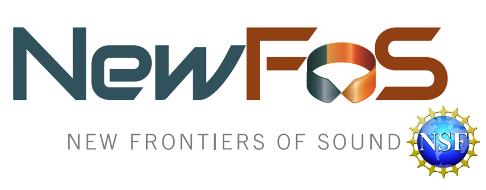

# GF_eta   

## Introduction

The geometric phase is a global measure of the spatial geometry of an acoustic or seismic field, making it a highly sensitive metric to changes in the ground properties.
The GF_eta package shows how to calculate the geometry phase of a seismic field by reconstructing the ground Green's function (GF) through seismic noise cross-correlations.

Our team is belong to the New Frontiers of Sound ([NewFoS](https://newfos.arizona.edu/)) Science and Technology Center, which is funded by the National Science Foundation (Grant Number 2242925) and is based at the University of Arizona in Tucson.

## What's inside the package

`cc.sh`: A MSNoise job script. We use the [MSNoise](http://msnoise.org/doc) (A seismic data processing tool) to cross-correlate continuous seismic data. 
The output is daily cross-correlation functions (CCFs) between every two seismic stations, approximating GFs between every two sites.
You can customize the control parameters by following the [instruction](http://msnoise.org/doc/workflow/001_msnoise_admin.html).
We directly provide the daily CCFs in `CCFs` and `CCFs2`.      
`custom.py`: A Python script that populates all stations throughout their `.xml` files into the MSNoise. `.xml` files can be downloaded with seismic data.

`eta.py`: A Python script to calculate $\Delta \eta$ by using daily CCFs. The output includes a time-frequency plot of $\Delta \eta(\omega,t)$, and $\Delta \eta$ time series along with local surface air temperature. We directly provide the measured $\Delta \eta$ in `output`.  
`cc_spec.py`: A Python script that evaluates Pearson's correlation spectrum between $\Delta \eta$ and surface air temperature.
The output is a Pearson's correlation matrix at each frequency and reference station.  
`CCFs` and `CCFs2`: Daily CCFs between every two seismic station recordings. All daily CCFs have been stacked every 10 days to enhance the reconstruction of GFs.  
`output`: The folder saves measured $\Delta \eta$. Each file name includes the reference station (MA1, MA2, MA3, MA4, MA6, MA7, MEI05).  
`ERA5`: The ERA5 environmental datasets (surface air temperature, surface pressure, and snow depth) at the local study area in Iceland.  
`figures`: Example plots from `eta.py` and `cc_spec.py`.

The seismic array information is available in the [FDSN](https://www.fdsn.org/networks/) (network code 4Q for MA1, MA2, MA3, MA4, MA6, MA7, and code 2C for MEI05), the seismic noise recordings can be downloaded using [obspy](https://docs.obspy.org/packages/autogen/obspy.clients.fdsn.mass_downloader.html#continuous-request) python tool.

## Methodology

We start building the complex state vector $C_{t}(\omega)$ that involves CCFs between the reference station and others as follows:  

$$ C_t (\omega) = \frac{1}{ \sqrt{ \sum^{N} \textbf{Re}(n)^2 + \textbf{Im}(n)^2 } } 
	\left(
		\begin{array}{c}
			C^{1}e^{i\phi_{1}}	\\
			C^{2}e^{i\phi_{2}} \\
			... \\
			C^{N}e^{i\phi_{n}}		
		\end{array}
	\right) , $$
 
where the complex state vector at a certain day $t$, $C_t(\omega)$, is a function of frequency $\omega$ and consists of $N$ components (number of NCFs). We apply the Fast Fourier Transform to each component of $C^N e^{i\phi_{n}}$, which includes its both real ($\textbf{Re}$) and imaginary ($\textbf{Im}$) parts. The denominator is to normalize all magnitudes to scale all components at the same level.

The change in geometric phase ($\Delta \eta$) of daily $C_{t}$ with respect to the reference $C_{ref}$ can be represented by their angle difference:   

$$ \Delta \eta(\omega,t) \approx arcos \left[ \textbf{Re}\left( C_{ref}^* \cdot C_t \right) \right]  \quad and \quad \Delta \eta \in [0,\pi] , $$  

We measure the angle difference by taking the $arcos$ function of the real part of the dot product between these two complex vectors. $^*$ denotes the complex conjugate.

## Requirements

The `eta.py` script should be run in a Python environment with the following required modules and recommended versions:

Python 3.7   

obspy 1.3.1  

matplotlib 3.5.3  

numpy 1.17.0   

scipy 1.7.3  

tqdm 4.66.1

(Optional) Please [install](http://msnoise.org/doc/installation.html) the MSNoise properly if you want to use it to cross-correlate seismic data and output NCFs:  

MSNoise 1.6.3 

## Usage

### Seismic cross-correlation (optional)
Put the downloaded seismic noise recordings, `cc.sh`, and `custom.py` in the same folder. Create a `station` folder and put `.xml` files for all stations in.   
Open the terminal, and run `bash cc.sh` in the command line after [installing](http://msnoise.org/doc/installation.html) the MSNoise.   
You can also use other software or scripts to output CCFs.

### Geometric phase measurements
Unzip all CCFs in both `CCFs` and `CCFs2` and put them together in `CCFs`.  
Put `CCFs` and `eta.py` in the same folder, open a terminal, and run `python eta.py` in the command line.  
You will see two plots of $\Delta \eta$ in the output folder `etas`, which are the same as plots in `figures`.   
You can save measured $\Delta \eta$ as individual files as those in the `output` if you uncomment "Save eta as .npy files" in the script `eta.py`.

### Analysis between $\Delta \eta$ and surface air temperature
Put `output` and `cc_spec.py` in the same folder, and run `python cc_spec.py`.

## Citation
Our latest manuscript has been submitted to *Journal of Geophysical Research: Earth Surface*:  
*Luo, B., Deymier, P., Beck, S., Runge, K., Huettmann, F., DeVaughn, S., Latypov, M. (2025). Geometric phase sensing of environmental changes based on ambient seismic noise: An application from Iceland.*

## Contact

**Bingxu Luo**  
Postdoctoral Research Associate I  
*Department of Geosciences, University of Arizona*  
bingxuluo@arizona.edu

