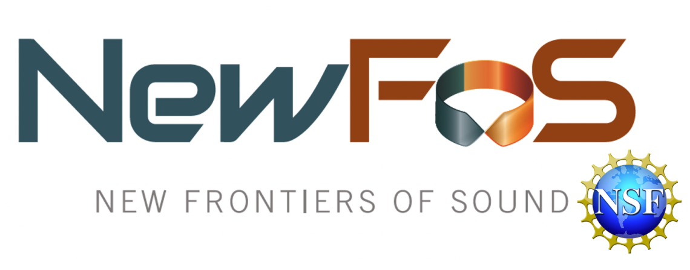

# GF_eta   




## Introduction
The geometric phase is a global measure of the spatial geometry of an acoustic or seismic field, making it a highly sensitive metric to changes in the wave supporting medium.
The changes in geometric phase ($\Delta \eta$) exhibits very high sensitivity to environmental changes and has the potential of making significant contributions to climate change.
This GF_eta package shows how to calculate the geometry phase of a seismic field by reconstructing the ground Green's function (GF) through seismic noise recordings.

``` cc.sh ```: A MSNoise job script. We use the MSNoise (A seismic data processing tool: http://msnoise.org/doc) to cross-correlate continuous seismic data. The output are daily noise correlation functions (NCFs) between every two seismic stations, approximating GFs between every two sites.

``` eta.py ```: A Python script. Calculating $\Delta \eta$ time series based on daily NCFs.


## Methodology

We follow this criteria to calculate the $\Delta \eta (\omega)$. The complex state vector $C_{t}(\omega)$ can be built by involving NCFs as follows:

$$ C_t (\omega) = \frac{1}{ \sqrt{ \sum^{N} \textbf{Re}(n)^2 + \textbf{Im}(n)^2 } } 
	\left(
		\begin{array}{c}
			C^{1}e^{i\phi_{1}}	\\
			C^{2}e^{i\phi_{2}} \\
			... \\
			C^{N}e^{i\phi_{n}}		
		\end{array}
	\right) , $$
 
where the complex state vector at a certain day $t$, $C_t(\omega)$, is a function of frequency $\omega$ and consists of $N$ components. We apply the Fast Fourier Transform to each component of $C^N e^{i\phi_{n}}$, which includes its both real ($\textbf{Re}$) and imaginary ($\textbf{Im}$) parts. The denominator is to normalize all magnitudes to scale all components at the same level.

The change in geometric phase ($\Delta \eta$) of daily $C_{t}$ with respect to the reference $C_{ref}$ can be represented by their angle difference: 
 
$$ \Delta \eta(\omega,t) \approx arcos \left[ \textbf{Re}\left( C_{ref}^* \cdot C_t \right) \right]  \quad and \quad \Delta \eta \in [0,\pi] , $$

We measure the angle difference by taking the $arcos$ function of the real part of the dot product between these two complex vectors. $^*$ denotes the complex conjugate.


## Requirements
This package should be run in a Python environment with the following required modules and recommended versions:

Python 3.7 

MSNoise 1.6.3 

obspy 1.3.1

matplotlib 3.5.3

numpy 1.17.0

scipy 1.7.3

tqdm 4.66.1


## Usage

## Citation
Our latest manuscript is being submitted:

` Bingxu Luo, Pierre A. Deymier, Susan L. Beck, Keith Runge, Falk Huettmann, Skyler DeVaughn, Marat Latypov. (2024). Geometric phase sensing of environmental changes based on seismic noise: An application from Iceland. `


## Acknowledgment

The package and research are supported by the New Frontiers of Sound ([NewFoS](https://newfos.arizona.edu/)) Science and Technology Center at University of Arizona, which is sponsored by U.S. National Science Foundation (Grant Number 2242925).


